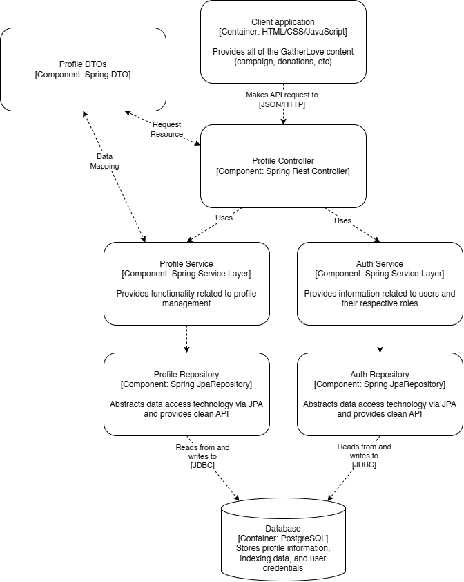
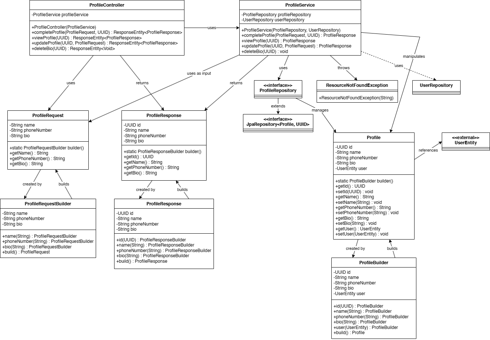

# GatherLove
- (2306152134) Allan Kwek
- (2306244942) Abhiseka Susanto
- (2306275954) Ida Made Revindra Dikta Mahendra
- (2306215154) Raden Ahmad Yasin Mahendra
- (2306152102) Janssen Benedict

# Setup PostgreSQL and Application Properties

## Step 1: Install PostgreSQL

If you haven't already, install PostgreSQL on your system. You can download the installer from the official PostgreSQL website: https://www.postgresql.org/download/

## Step 2: Create a Database

Create a new database in PostgreSQL using the following command:
```sql
CREATE DATABASE gatherlove;
```

## Step 3: Configure application-dev.properties

Copy the `.env.example` file to a new file `.env`.


Edit the `.env` file to update the database connection properties:
```properties
DB_URL=jdbc:postgresql://localhost:5432/gatherlove
DB_USERNAME=your_username
DB_PASSWORD=your_password
```
Replace `your_username` and `your_password` with the values you have.

## Step 4: Verify the Configuration

Start the application by using `run.sh` or `run.bat` and verify that it can connect to the database successfully.

That's it! You should now have PostgreSQL and `.env` set up and configured for your application.

# Software Architecture

## Current Architecture
Pada pengembangan GatherLove, kami memilih arsitektur monolitik karena beberapa alasan utama:

### 1. Kemudahan Pengembangan
Semua modul berada dalam satu basis kode. Ini memudahkan setup proyek, penulisan pengujian, serta proses perbaikan bug.

### 2. Skala yang Sesuai
Saat ini target pengguna GatherLove masih berada pada skala kecil hingga menengah. Dengan volume trafik dan kompleksitas yang terkelola, arsitektur monolitik sudah mencukupi tanpa menambah overhead komunikasi antar services.

### 3. Performa Internal Cepat
Karena seluruh komponen berjalan dalam satu proses, komunikasi antar-modul terjadi secara langsung (in-memory), mengurangi latensi dibandingkan bila melalui protokol jaringan.

Ini adalah visualisasi dari arsitektur proyek ini

### System Context Diagram


### Container Diagram
.jpg)

### Deployment Diagram


## Potential Future Architecture
Meskipun saat ini arsitektur monolitik adalah pilihan paling langsung, seiring pertumbuhan jumlah pengguna dan kompleksitas fitur, beban sistem bisa meningkat secara signifikan. Jika kondisi tersebut terjadi, kami akan mempertimbangkan untuk memecah modul‑modul kunci menjadi microservices terpisah.

### Potential Future Architecture using container diagram
.jpg)

## Risk Storming Analysis for Transitioning Software Architecture
Berdasarkan hasil diskusi, kami mengidentifikasi beberapa risk hotspot pada arsitektur monolitik, khususnya pada API Application dan Database, yang berpotensi menjadi bottleneck apabila skala pengguna dan kompleksitas fungsional bertambah. Untuk memitigasi risiko tersebut, kami mengusulkan pemecahan arsitektur sebagai berikut:

### 1. API Gateway

- Risiko awal: Semua permintaan klien terpusat pada satu entry point, rentan terhadap single point of failure dan kesulitan skala.

- Mitigasi: Gateway bertugas autentikasi, routing, dan load balancing, sehingga beban dapat didistribusikan ke layanan internal.

### 2. Auth/User Service

- Risiko awal: Authentication dan manajemen pengguna monolitik menimbulkan overhead logika dan basis data yang padat.

- Mitigasi: Menjadikannya layanan terpisah dengan database sendiri, memudahkan scaling independen saat trafik authentication melonjak.

### 3. Main Service (Campaign, Wallet, Donation)

- Risiko awal: Logika bisnis bercampur dengan Auth dan Admin, sulit di-debug dan dioptimasi per modul.

- Mitigasi: Dipisah sehingga modul-modul dapat diuji, di‑deploy, dan didiskalakan secara mandiri sesuai kebutuhan.

### 4. Admin Service

- Risiko awal: Fitur administrasi lokal berpotensi mengganggu jalannya core flow jika terjadi error.

- Mitigasi: Dikelola oleh layanan terpisah dengan database terisolasi, sehingga kegagalan administrasi tidak menjatuhkan sistem utama.

### 5. Database Terpisah

- Setiap layanan (Auth/User, Main, Admin) memiliki instance PostgreSQL sendiri, mengurangi kontensi I/O dan memudahkan replikasi atau sharding khusus modul.

### Risk Storming: Identification


### Risk Storming: Consensus


### Risk Storming: Mitigation
.jpg)

## Individual Component Diagrams and Code Diagrams

### Wallet Module: Component Diagram


### Wallet Module: Code Diagram


---

### Profile Module: Component Diagram


### Profile Module: Code Diagram


---

### Donation Module: Component Diagram


### Donation Module: Code Diagram


---

### Admin Dashboard Module: Component Diagram (Yasin)


### Admin Dashboard Module: Code Diagram (Yasin)
#### Announcement


#### Admin Dashboard


#### Admin Donation


#### Campaign

